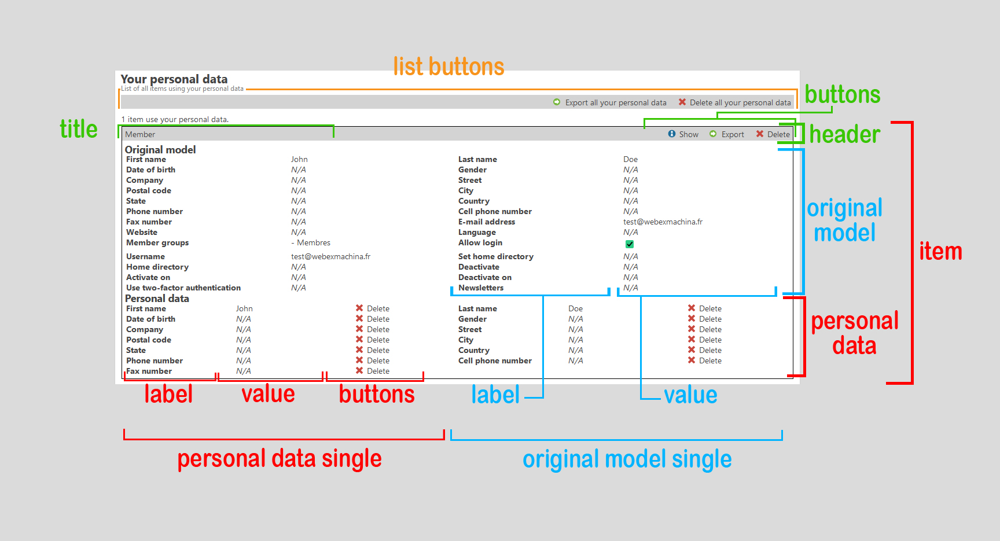

Hooks
=====

Here you can find all available hooks and their documentation.

:warning: Those hooks aren't registered in `$GLOBALS['TL_HOOKS']` but in `$GLOBALS['WEM_HOOKS']`.

List
----

### Personal Data List





Hook | Return Value | Description
--- | --- | ---
`sortData` | `array` | Called after the personal data have been retrieved and arranged.
`buildListButtons` | `array` | Called after the action buttons for the whole list have been generated.
`renderListButtons` | `string` | Called after the action buttons for the whole list have been generated.
`renderSingleItem` | `string` | Called after a whole item have been generated.
`renderSingleItemHeader` | `string` | Called after the item's header have been generated.
`renderSingleItemTitle` | `string` | Called after an item's header's title have been generated.
`buildSingleItemButtons` | `array` | Called after an item's header's buttons have been generated.
`renderSingleItemButtons` | `string` | Called after an item's header's buttons have been generated.
`renderSingleItemBody` | `string` | Called after an item's body have been generated.
`renderSingleItemBodyOriginalModel` | `string` | Called after an item's whole original model have been generated.
`renderSingleItemBodyOriginalModelSingle` | `string` | Called after an item's original model's single row have been generated
`renderSingleItemBodyOriginalModelSingleFieldLabel` | `string` | Called after an item's original model's single row field label have been generated
`renderSingleItemBodyOriginalModelSingleFieldValue` | `string` | Called after an item's original model's single row field value have been generated
`renderSingleItemBodyPersonalData` | `string` | Called after an item's whole personal data list have been generated
`renderSingleItemBodyPersonalDataSingle` | `string` | Called after an item's personal data list row have been generated
`renderSingleItemBodyPersonalDataSingleFieldLabel` | `string` | Called after an item's personal data list row's field label have been generated
`renderSingleItemBodyPersonalDataSingleFieldValue` | `string` | Called after an item's personal data list row's field value have been generated
`buildSingleItemBodyPersonalDataSingleButtons` | `array` | Called after an item's personal data list row's buttons have been generated
`renderSingleItemBodyPersonalDataSingleButtons` | `string` | Called after an item's personal data list row's buttons have been generated
`getHrefByPidAndPtableAndEmail` | `string` | Called when clicking on the "show" button of an item
`isPersonalDataLinkedToFile` | `bool` | Check if a single personal data item is associated to a file (without testing if the linked file exists or not)
`getFileByPidAndPtableAndEmailAndField` | `\Contao\FilesModel|null` | Called when clicking on the "show" or "download" button of a single personal data item associated to a file

### CSV Exporter

Hook | Return value | Description
--- | --- | ---
`formatHeaderForCsvExport` | `array` | Header for CSV exports
`formatSinglePersonalDataForCsvExport` | `array` | Data for each single Personal Data item
`exportByEmail` | `\Contao\Model\Collection|null` | Data to export
`exportByPidAndPtableAndEmail` | `\Contao\Model\Collection|null` | Data to export


### Anonymizer

Hook | Return value | Description
--- | --- | ---
`anonymize` | `void` | Called after a personal data have been anonymized
`anonymizeByEmail` | `\Contao\Model\Collection|null` | Called after retrieving personal data linked to an email and before anonymization process
`anonymizeByPidAndPtableAndEmail` | `\Contao\Model\Collection|null` | Called after retrieving personal data linked to a pid, ptable and email and before anonymization process
`anonymizeByPidAndPtableAndEmailAndField` | `\WEM\PersonalDataManagerBundle\Model\PersonalData|null` | Called after retrieving personal data linked to pid, ptable, email and field and before anonymization process

Details
-------

### sortData

Called after the personal data have been retrieved and arranged.

**Return value** : `array` in the following form
```php
[
	'ptable'=>[
		'id'=>[
			'originalModel'=> 'The model corresponding to personal data pid & ptable or the one you want to display in the "original object" section',
			'personalDatas'=>[
				'first personalData linked to the "originalModel" entity',
				'second personalData linked to the "originalModel" entity'
			]
		]
	]
]
```


**Arguments**:
Name | Type | Description
--- | --- | ---
$sorted | `string` | The data already sorted
$personalDatas | `\Contao\Model\Collection|null` | The raw Personal Data Collection used to build the sorted data array

**Code**:
```php
public function sortData(
	array $sorted, 
	?\Contao\Model\Collection $personalDatas
): array
{
	return $sorted;
}
```

### buildListButtons

Called after the action buttons for the whole list have been generated.

**Return value** : `array`

**Arguments**:
Name | Type | Description
--- | --- | ---
$email | `string` | The email address linked to the personal data
$nbRows | `int` | Number of items in the list
$buttons | `array` | The array containing buttons HTML code

**Code**:
```php
public function buildListButtons(
	string $email, 
	int $nbRows, 
	array $buttons
): array
{
	return $buttons;
}
```

### renderListButtons

Called after the action buttons for the whole list have been generated.

**Return value** : `string`

**Arguments**:
Name | Type | Description
--- | --- | ---
$email | `string` | The email address linked to the personal data
$nbRows | `int` | Number of items in the list
$buffer | `string` | The generated HTML code

**Code**:
```php
public function renderListButtons(
	string $email, 
	int $nbRows, 
	string $buffer
): string
{
	return $buffer;
}
```

### renderSingleItem

Called after a whole item have been generated.

**Return value** : `string`

**Arguments**:
Name | Type | Description
--- | --- | ---
$pid | `int` | The pid linked to the personal data
$ptable | `string` | The ptable linked to the personal data
$email | `string` | The email address linked to the personal data
$personalDatas | `array` | All personal data linked to the item
$originalModel | `Contao\Model` | The original model
$buffer | `string` | The generated HTML code

**Code**:
```php
public function renderSingleItem(
	int $pid, 
	string $ptable, 
	string $email, 
	array $personalDatas, 
	\Contao\Model $originalModel, 
	string $buffer
): string
{
	return $buffer;
}
```

### renderSingleItemHeader

Called after an item's header have been generated.

**Return value** : `string`

**Arguments**:
Name | Type | Description
--- | --- | ---
$pid | `int` | The pid linked to the personal data
$ptable | `string` | The ptable linked to the personal data
$email | `string` | The email address linked to the personal data
$personalDatas | `array` | All personal data linked to the item
$originalModel | `Contao\Model` | The original model
$buffer | `string` | The generated HTML code

**Code**:
```php
public function renderSingleItemHeader(
	int $pid, 
	string $ptable, 
	string $email,
	array $personalDatas, 
	\Contao\Model $originalModel, 
	string $buffer
): string
{
	return $buffer;
}
```

### renderSingleItemTitle

Called after an item's header's title have been generated.

**Return value** : `string`

**Arguments**:
Name | Type | Description
--- | --- | ---
$pid | `int` | The pid linked to the personal data
$ptable | `string` | The ptable linked to the personal data
$email | `string` | The email address linked to the personal data
$personalDatas | `array` | All personal data linked to the item
$originalModel | `Contao\Model` | The original model
$buffer | `string` | The generated HTML code

**Code**:
```php
public function renderSingleItemTitle(
	int $pid, 
	string $ptable, 
	string $email,
	array $personalDatas, 
	\Contao\Model $originalModel, 
	string $buffer
): string
{
	return $buffer;
}
```

### buildSingleItemButtons

Called after an item's header's buttons have been generated.

**Return value** : `array`

**Arguments**:
Name | Type | Description
--- | --- | ---
$pid | `int` | The pid linked to the personal data
$ptable | `string` | The ptable linked to the personal data
$email | `string` | The email address linked to the personal data
$personalDatas | `array` | All personal data linked to the item
$originalModel | `Contao\Model` | The original model
$buttons | `array` | The array containing buttons HTML code

**Code**:
```php
public function buildSingleItemButtons(
	int $pid, 
	string $ptable, 
	string $email,
	array $personalDatas, 
	\Contao\Model $originalModel, 
	array $buttons
): array
{
	return $buttons;
}
```

### renderSingleItemButtons

Called after an item's header's buttons have been generated.

**Return value** : `string`

**Arguments**:
Name | Type | Description
--- | --- | ---
$pid | `int` | The pid linked to the personal data
$ptable | `string` | The ptable linked to the personal data
$email | `string` | The email address linked to the personal data
$personalDatas | `array` | All personal data linked to the item
$originalModel | `Contao\Model` | The original model
$buffer | `string` | The generated HTML code

**Code**:
```php
public function renderSingleItemButtons(
	int $pid, 
	string $ptable, 
	string $email,
	array $personalDatas, 
	\Contao\Model $originalModel, 
	string $buffer
): string
{
	return $buffer;
}
```

### renderSingleItemBody

Called after an item's body have been generated.

**Return value** : `string`

**Arguments**:
Name | Type | Description
--- | --- | ---
$pid | `int` | The pid linked to the personal data
$ptable | `string` | The ptable linked to the personal data
$email | `string` | The email address linked to the personal data
$personalDatas | `array` | All personal data linked to the item
$originalModel | `Contao\Model` | The original model
$buffer | `string` | The generated HTML code

**Code**:
```php
public function renderSingleItemBody(
	int $pid, 
	string $ptable, 
	string $email,
	array $personalDatas, 
	\Contao\Model $originalModel, 
	string $buffer
): string
{
	return $buffer;
}
```

### renderSingleItemBodyOriginalModel

Called after an item's whole original model have been generated

**Return value** : `string`

**Arguments**:
Name | Type | Description
--- | --- | ---
$pid | `int` | The pid linked to the personal data
$ptable | `string` | The ptable linked to the personal data
$email | `string` | The email address linked to the personal data
$personalDatas | `array` | All personal data linked to the item
$originalModel | `Contao\Model` | The original model
$buffer | `string` | The generated HTML code

**Code**:
```php
public function renderSingleItemBodyOriginalModel(
	int $pid, 
	string $ptable, 
	string $email,
	array $personalDatas, 
	\Contao\Model $originalModel, 
	string $buffer
): string
{
	return $buffer;
}
```

### renderSingleItemBodyOriginalModelSingle

Called after an item's original model's single row have been generated

**Return value** : `string`

**Arguments**:
Name | Type | Description
--- | --- | ---
$pid | `int` | The pid linked to the personal data
$ptable | `string` | The ptable linked to the personal data
$email | `string` | The email address linked to the personal data
$field | `string` | The field linked to the personal data
$value | `mixed` | The value linked to the personal data
$personalDatas | `array` | All personal data linked to the item
$originalModel | `Contao\Model` | The original model
$buffer | `string` | The generated HTML code

**Code**:
```php
public function renderSingleItemBodyOriginalModelSingle(
	int $pid, 
	string $ptable, 
	string $email,
	string $field, 
	$value, 
	array $personalDatas, 
	\Contao\Model $originalModel, 
	string $buffer
): string
{
	return $buffer;
}
```

### renderSingleItemBodyOriginalModelSingleFieldLabel

Called after an item's original model's single row field label have been generated

**Return value** : `string`

**Arguments**:
Name | Type | Description
--- | --- | ---
$pid | `int` | The pid linked to the personal data
$ptable | `string` | The ptable linked to the personal data
$email | `string` | The email address linked to the personal data
$field | `string` | The field linked to the personal data
$value | `mixed` | The value linked to the personal data
$personalDatas | `array` | All personal data linked to the item
$originalModel | `Contao\Model` | The original model
$buffer | `string` | The generated HTML code

**Code**:
```php
public function renderSingleItemBodyOriginalModelSingleFieldLabel(
	int $pid, 
	string $ptable, 
	string $email,
	string $field, 
	$value, 
	array $personalDatas, 
	\Contao\Model $originalModel, 
	string $buffer
): string
{
	return $buffer;
}
```

### renderSingleItemBodyOriginalModelSingleFieldValue

Called after an item's original model's single row field value have been generated

**Return value** : `string`

**Arguments**:
Name | Type | Description
--- | --- | ---
$pid | `int` | The pid linked to the personal data
$ptable | `string` | The ptable linked to the personal data
$email | `string` | The email address linked to the personal data
$field | `string` | The field linked to the personal data
$value | `mixed` | The value linked to the personal data
$personalDatas | `array` | All personal data linked to the item
$originalModel | `Contao\Model` | The original model
$buffer | `string` | The generated HTML code

**Code**:
```php
public function renderSingleItemBodyOriginalModelSingleFieldValue(
	int $pid, 
	string $ptable,
	string $email, 
	string $field, 
	$value, 
	array $personalDatas, 
	\Contao\Model $originalModel, 
	string $buffer
): string
{
	return $buffer;
}
```

### renderSingleItemBodyPersonalData

Called after an item's whole personal data list have been generated

**Return value** : `string`

**Arguments**:
Name | Type | Description
--- | --- | ---
$pid | `int` | The pid linked to the personal data
$ptable | `string` | The ptable linked to the personal data
$email | `string` | The email address linked to the personal data
$personalDatas | `array` | All personal data linked to the item
$originalModel | `Contao\Model` | The original model
$buffer | `string` | The generated HTML code

**Code**:
```php
public function renderSingleItemBodyPersonalData(
	int $pid, 
	string $ptable, 
	string $email,
	array $personalDatas, 
	\Contao\Model $originalModel, 
	string $buffer
): string
{
	return $buffer;
}
```

### renderSingleItemBodyPersonalDataSingle

Called after an item's personal data list row have been generated

**Return value** : `string`

**Arguments**:
Name | Type | Description
--- | --- | ---
$pid | `int` | The pid linked to the personal data
$ptable | `string` | The ptable linked to the personal data
$email | `string` | The email address linked to the personal data
$personalData | `WEM\PersonalDataManagerBundle\Model\PersonalData` | The personal data row linked to the item
$personalDatas | `array` | All personal data linked to the item
$originalModel | `Contao\Model` | The original model
$buffer | `string` | The generated HTML code

**Code**:
```php
public function renderSingleItemBodyPersonalDataSingle(
	int $pid, 
	string $ptable, 
	string $email,
	\WEM\PersonalDataManagerBundle\Model\PersonalData $personalData, 
	array $personalDatas, 
	\Contao\Model $originalModel, 
	string $buffer
): string
{
	return $buffer;
}
```

### renderSingleItemBodyPersonalDataSingleFieldLabel

Called after an item's personal data list row's field label have been generated

**Return value** : `string`

**Arguments**:
Name | Type | Description
--- | --- | ---
$pid | `int` | The pid linked to the personal data
$ptable | `string` | The ptable linked to the personal data
$email | `string` | The email address linked to the personal data
$personalData | `WEM\PersonalDataManagerBundle\Model\PersonalData` | The personal data row linked to the item
$personalDatas | `array` | All personal data linked to the item
$originalModel | `Contao\Model` | The original model
$buffer | `string` | The generated HTML code

**Code**:
```php
public function renderSingleItemBodyPersonalDataSingleFieldLabel(
	int $pid, 
	string $ptable, 
	string $email,
	\WEM\PersonalDataManagerBundle\Model\PersonalData $personalData, 
	array $personalDatas, 
	\Contao\Model $originalModel, 
	string $buffer
): string
{
	return $buffer;
}
```

### renderSingleItemBodyPersonalDataSingleFieldValue

Called after an item's personal data list row's field value have been generated

**Return value** : `string`

**Arguments**:
Name | Type | Description
--- | --- | ---
$pid | `int` | The pid linked to the personal data
$ptable | `string` | The ptable linked to the personal data
$email | `string` | The email address linked to the personal data
$personalData | `WEM\PersonalDataManagerBundle\Model\PersonalData` | The personal data row linked to the item
$personalDatas | `array` | All personal data linked to the item
$originalModel | `Contao\Model` | The original model
$buffer | `string` | The generated HTML code

**Code**:
```php
public function renderSingleItemBodyPersonalDataSingleFieldValue(
	int $pid, 
	string $ptable, 
	string $email,
	\WEM\PersonalDataManagerBundle\Model\PersonalData $personalData, 
	array $personalDatas, 
	\Contao\Model $originalModel, 
	string $buffer
): string
{
	return $buffer;
}
```

### buildSingleItemBodyPersonalDataSingleButtons

Called after an item's personal data list row's field buttons have been generated

**Return value** : `array`

**Arguments**:
Name | Type | Description
--- | --- | ---
$pid | `int` | The pid linked to the personal data
$ptable | `string` | The ptable linked to the personal data
$email | `string` | The email address linked to the personal data
$personalData | `WEM\PersonalDataManagerBundle\Model\PersonalData` | The personal data row linked to the item
$personalDatas | `array` | All personal data linked to the item
$originalModel | `Contao\Model` | The original model
$file | `Contao\File|null` | The file associated to the personal data if any
$buttons | `array` | The array containing buttons HTML code

**Code**:
```php
public function buildSingleItemBodyPersonalDataSingleButtons(
	int $pid, 
	string $ptable, 
	string $email,
	\WEM\PersonalDataManagerBundle\Model\PersonalData $personalData, 
	array $personalDatas, 
	\Contao\Model $originalModel, 
	\Contao\File $file, 
	array $buttons
): array
{
	return $buttons;
}
```

### renderSingleItemBodyPersonalDataSingleButtons

Called after an item's personal data list row's field buttons have been generated

**Return value** : `string`

**Arguments**:
Name | Type | Description
--- | --- | ---
$pid | `int` | The pid linked to the personal data
$ptable | `string` | The ptable linked to the personal data
$email | `string` | The email address linked to the personal data
$personalData | `WEM\PersonalDataManagerBundle\Model\PersonalData` | The personal data row linked to the item
$personalDatas | `array` | All personal data linked to the item
$originalModel | `Contao\Model` | The original model
$buffer | `string` | The generated HTML code

**Code**:
```php
public function renderSingleItemBodyPersonalDataSingleButtons(
	int $pid, 
	string $ptable, 
	string $email,
	\WEM\PersonalDataManagerBundle\Model\PersonalData $personalData, 
	array $personalDatas, 
	\Contao\Model $originalModel, 
	string $buffer
): string
{
	return $buffer;
}
```

### isPersonalDataLinkedToFile

Check if a single personal data item is associated to a file (without testing if the linked file exists or not)

**Return value** : `bool`

**Arguments**:
Name | Type | Description
--- | --- | ---
$personalData | `\WEM\PersonalDataManagerBundle\Model\PersonalData` | The personal data
$isLinkedToFile | `bool` | The value calculated by the system and previous hooks (if any)

**Code**:
```php
public function isPersonalDataLinkedToFile(
	\WEM\PersonalDataManagerBundle\Model\PersonalData $personalData,
	bool $isLinkedToFile
): bool
{
	return $isLinkedToFile;
}
```

### getFileByPidAndPtableAndEmailAndField

Called when clicking on the "show" or "download" button of a single personal data item linked to a file

**Return value** : `\Contao\FilesModel|null`

**Arguments**:
Name | Type | Description
--- | --- | ---
$pid | `int` | The pid linked to the personal data
$ptable | `string` | The ptable linked to the personal data
$email | `string` | The email linked to the personal data
$field | `string` | The field linked to the personal data
$personalData | `\WEM\PersonalDataManagerBundle\Model\PersonalData` | The personal data
$value | `mixed` | The personal data's value (decrypted)
$objFileModel | `\Contao\FilesModel|null` | The FilesModel object found linked to the personal data

**Code**:
```php
public function getFileByPidAndPtableAndEmailAndField(
	string $pid, 
	string $ptable,
	string $email,
	string $field,
	\WEM\PersonalDataManagerBundle\Model\PersonalData $personalData, 
	$value,
	?\Contao\FilesModel $objFileModel
): ?\Contao\FilesModel
{
	return $objFileModel;
}
```

### getHrefByPidAndPtableAndEmail

Called when clicking on the "show" button of an item

**Return value** : `string`

**Arguments**:
Name | Type | Description
--- | --- | ---
$pid | `int` | The pid linked to the personal data
$ptable | `string` | The ptable linked to the personal data
$email | `string` | The email linked to the personal data
$buffer | `string` | The generated HTML code

**Code**:
```php
public function getHrefByPidAndPtableAndEmail(
	string $pid, 
	string $ptable,
	string $email,
	string $buffer
): string
{
	return $buffer;
}
```

### formatHeaderForCsvExport

Called after the CSV header have been created

**Return value** : `array`

**Arguments**:
Name | Type | Description
--- | --- | ---
$header | `array` | The header columns for the CSV export

**Code**:
```php
public function formatHeaderForCsvExport(
	array $header
): array
{
	return $header;
}
```

### formatSinglePersonalDataForCsvExport

Called after the CSV row for a single personal data row have been created

**Return value** : `array`

**Arguments**:
Name | Type | Description
--- | --- | ---
$personalData | `WEM\PersonalDataManagerBundle\Model\PersonalData` | The personal data row
$header | `array` | The header columns for the CSV export
$row | `array` | The row corresponding to the current personal data

**Code**:
```php
public function formatSinglePersonalDataForCsvExport(
	\WEM\PersonalDataManagerBundle\Model\PersonalData $personalData, 
	array $header, 
	array $row
): array
{
	return $row;
}
```

### exportByEmail

Called after retrieving personal data linked to an email and before export process

**Return value** : `\Contao\Model\Collection|null`

**Arguments**:
Name | Type | Description
--- | --- | ---
$email | `string` | The email
$pdms | `\Contao\Model\Collection|null` | The personal data found

**Code**:
```php
public function exportByEmail(
	string $email, 
	?\Contao\Model\Collection $pdms
): ?\Contao\Model\Collection
{
    return $pdms;
}
```

### exportByPidAndPtableAndEmail

Called after retrieving personal data linked to a pid, ptable and email and before export process

**Return value** : `\Contao\Model\Collection|null`

**Arguments**:
Name | Type | Description
--- | --- | ---
$pid | `string` | The pid
$ptable | `string` | The ptable
$email | `string` | The email
$pdms | `\Contao\Model\Collection|null` | The personal data found

**Code**:
```php
public function exportByPidAndPtableAndEmail(
	string $pid, 
	string $ptable, 
	string $email, 
	?\Contao\Model\Collection $pdms
): ?\Contao\Model\Collection
{
    return $pdms;
}
```

### anonymize

Called after a personal data have been anonymized

**Return value** : `void`

**Arguments**:
Name | Type | Description
--- | --- | ---
$personalData | `\WEM\PersonalDataManagerBundle\Model\PersonalData` | The anonymized personal data
$value | `mixed` | The decrypted value before anonymization

**Code**:
```php
public function anonymize(
	\WEM\PersonalDataManagerBundle\Model\PersonalData $personalData, 
	$value
): void
{
    // do stuff
}
```

### anonymizeByEmail

Called after retrieving personal data linked to an email and before anonymization process

**Return value** : `\Contao\Model\Collection|null`

**Arguments**:
Name | Type | Description
--- | --- | ---
$email | `string` | The email
$pdms | `\Contao\Model\Collection|null` | The personal data found

**Code**:
```php
public function anonymizeByEmail(
	string $email, 
	?\Contao\Model\Collection $pdms
): ?\Contao\Model\Collection
{
    return $pdms;
}
```

### anonymizeByPidAndPtableAndEmail

Called after retrieving personal data linked to a pid, ptable and email and before anonymization process

**Return value** : `\Contao\Model\Collection|null`

**Arguments**:
Name | Type | Description
--- | --- | ---
$pid | `string` | The pid
$ptable | `string` | The ptable
$email | `string` | The email
$pdms | `\Contao\Model\Collection|null` | The personal data found

**Code**:
```php
public function anonymizeByPidAndPtableAndEmail(
	string $pid, 
	string $ptable, 
	string $email, 
	?\Contao\Model\Collection $pdms
): ?\Contao\Model\Collection
{
    return $pdms;
}
```

### anonymizeByPidAndPtableAndEmailAndField

Called after retrieving personal data linked to a pid, ptable, email and field and before anonymization process

**Return value** : `\WEM\PersonalDataManagerBundle\Model\PersonalData|null`

**Arguments**:
Name | Type | Description
--- | --- | ---
$pid | `string` | The pid
$ptable | `string` | The ptable
$email | `string` | The email
$field | `string` | The field
$pdm | `\WEM\PersonalDataManagerBundle\Model\PersonalData|null` | The personal data found

**Code**:
```php
public function anonymizeByEmail(
	string $pid, 
	string $ptable, 
	string $email, 
	string $field, 
	?\WEM\PersonalDataManagerBundle\Model\PersonalData $pdm
): ?\WEM\PersonalDataManagerBundle\Model\PersonalData
{
    return $pdm;
}
```